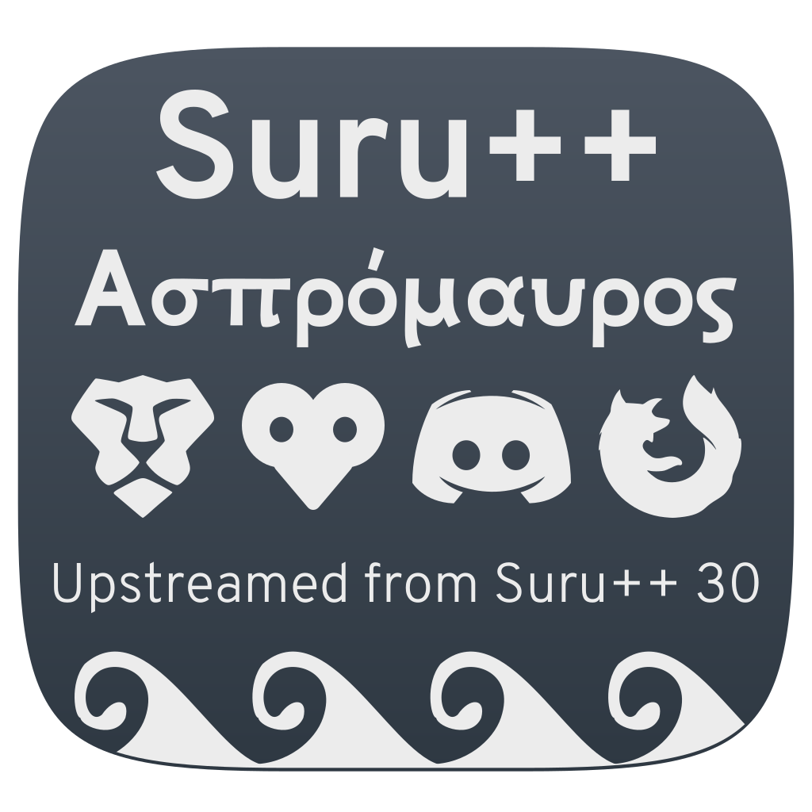

<p align="center"> 
  
</p>

<h2 align="center">Suru++ Asprómauros</h2>

<p align="center">
  
  
  
  
  
  
</p>

These aspromautic or monochromatic icons are based on [Suru++ 30 Dark](https;//github.com/gusbemacbe/suru-plus-dark) icons of sizes 16, 24 and 32. It is flat, minimalist and designed for full dark environments. 

The word "Asprómauros" comes from the modern Greek word *ασπρόμαυρος*, which means *black and white*.

Observe that Suru++ Asprómauros also supports gradient colours, and is compatible with Oomox and with [Suru++ Colourise](https://github.com/gusbemacbe/suru-plus-colourise).

- [Installing with CLI](#installing-with-cli)
    - [ROOT directory (recommended)](#root-directory-recommended)
    - [HOME directory for GTK](#home-directory-for-gtk)
    - [HOME directory for KDE](#home-directory-for-kde)
    - [\*BSD systems](#bsd-systems)
    - [Uninstall](#uninstall)
- [Known bugs](#known-bugs)
  - [Snap-built apps](#snap-built-apps)
  - [AppImage-built apps](#appimage-built-apps)
  - [Hardcoded application icons with ugly name](#hardcoded-application-icons-with-ugly-name)
  - [Hardcoded tray icons](#hardcoded-tray-icons)
  - [Unrecognised and ugly icons](#unrecognised-and-ugly-icons)
    - [Okular icon and other icons](#okular-icon-and-other-icons)
- [Report](#report)
- [Contribution](#contribution)
- [Contributors](#contributors)
- [Changelog](#changelog)
- [Donation](#donation)
- [Credits and Licences](#credits-and-licences)

## Installing with CLI

Use the scripts to install the latest version directly from this repository (independently of your distribution):

**NOTE:** Use the same command to update the icon theme.

#### ROOT directory (recommended)

```
wget -qO- https://raw.githubusercontent.com/gusbemacbe/suru-plus-aspromauros/master/install.sh | sh
```

#### HOME directory for GTK

```
wget -qO- https://raw.githubusercontent.com/gusbemacbe/suru-plus-aspromauros/master/install.sh | env DESTDIR="$HOME/.icons" sh
```

#### HOME directory for KDE

```
wget -qO- https://raw.githubusercontent.com/gusbemacbe/suru-plus-aspromauros/master/install.sh | env DESTDIR="$HOME/.local/share/icons" sh
```

#### \*BSD systems

```
wget -qO- https://raw.githubusercontent.com/gusbemacbe/suru-plus-aspromauros/master/install.sh | env DESTDIR="/usr/local/share/icons" sh
```

#### Uninstall

```
wget -qO- https://raw.githubusercontent.com/gusbemacbe/suru-plus-aspromauros/master/install.sh | env uninstall=true sh
```

## Known bugs

### Snap-built apps

Unfortunately the snap-built apps are not supported almost by any icons themes, because the icons are hardcoded and the desktop files are not hosted in the folder `~/.local/share/applications` or `/usr/share/applications`.

To solve it, please follow the instructions:

1. Do:

```bash
# Copy all desktop files of all snap-built apps to "~/.local/share/applications"
sudo cp /var/lib/snapd/desktop/applications/*.desktop ~/.local/share/applications
# To de-sudo the files
sudo chmod -R 777 ~/.local/share/applications
# To remove the duplicates
sudo rm /var/lib/snapd/desktop/applications/*.desktop
```

2. Go to the directory  `~/.local/share/applications`;
3. Open each desktop file of snap app with your favourite text editor and modify the encoded path of `Icon` to the simple path with no extension. For example, if you use Insomnia:

```bash
Icon=snap/icons/icon.png
Icon=insomnia
```

### AppImage-built apps

With AppImageLauncher installed, you click an AppImage, it is automatically integrated to `~/Applications`, and desktop files are automatically created into `~/local/share/applications`. But if you modify one of the AppImage-built app desktop file to correct the icon path, AppImageLauncher reverts automatically the desktop file to the original and keeps again the icon path hardcoded. It also removes the option `StartupWMClass`. We recommend you to ban `AppImageLauncher`. 

1. Remove `appimagelauncher` via terminal;
2. Make all AppImages executable and trusted:

```bash
chmod a+x *.AppImage
```

3. Reboot;
4. Create the desktop files manually in the directory `~/.local/share/applications`. Do not forget of adding the option `StartupWMClass` (to know which, use the command `xprop WM_CLASS` to calibrate an AppImage window) or the icon will be unrecognised or ugly. 

### Hardcoded application icons with ugly name

We have already icons, but it is wrong or ugly name, or because the icon is hardcoded. For example, the application GitHub Desktop used `Icon=desktop.png` and other apps, like Insomnia, use `Icon=icon.png`, or worse, `Icon=stupid/path/icon.png`. 

To deal with hardcoded application icons we recommend to install [hardcode-fixer](https://github.com/Foggalong/hardcode-fixer). Suru++ supports most of the applications in the list. If [hardcode-fixer](https://github.com/Foggalong/hardcode-fixer) doesn't support your favourite app yet, please open an [issue here](https://github.com/Foggalong/hardcode-fixer/issues) or edit your .desktop file manually.

### Hardcoded tray icons

To fix hardcoded tray icons, install and use [Hardcode-Tray script](https://github.com/bil-elmoussaoui/Hardcode-Tray). A list of supported applications is available here.

To get Suru++ to work right with [Hardcode-Tray script](https://github.com/bil-elmoussaoui/Hardcode-Tray), use the `hardcode-tray option --conversion-tool RSVGConvert`:

```bash
sudo -E hardcode-tray --conversion-tool RSVGConvert --size 22 --theme Suru++
```

### Unrecognised and ugly icons

#### Okular icon and other icons

Not just Suru++, it also affects Numix icons theme. It is a missed `StartupWMClass` option in the desktop files in KDE and an icon cache bug in GNOME and KDE. 

1. Install and use [StartupWMClassFixer](https://github.com/bilelmoussaoui/StartupWMClassFixer);
2. Install and use [Stacer](https://github.com/oguzhaninan/Stacer) to clean caches;
3. Log out and log in.

## Report

* Do you find the missed icons?
* Do you find the misused and ugly icons?
* Did you find the errors?

Report, but please provide well-detailed information. Or I will have difficulty to understand what you are saying or to know which app you are referring.

## Contribution

* Would you like to improve our repository?
* Do you want to add and request the icons? Make a pull request and we will analyse and approve or not.

Please visit the [Design Guidelines](https://gusbemacbe.github.io/suru-plus-site).

## Contributors

The contributors is on the file [AUTHORS](AUTHORS).

## Changelog

The changelog is available on the release page in theme's repository.

## Donation

<a href="https://www.paypal.com/cgi-bin/webscr?cmd=_donations&business=gusbemacbe%40gmail%2ecom&lc=BR&item_name=Suru%2b%2b%20Project&item_number=SURUFAMILYGBRC&currency_code=USD&bn=PP%2dDonationsBF%3abtn_donate_SM%2egif%3aNonHosted">Donate here</a>

## Credits and Licences

* CC BY-SA/GPL3 © 2018-2019 [Suru Icons](https://github.com/snwh/suru-icon-theme) by [Sam Hewitt](https://github.com/snwh).
* GPL3 © 2018-2019 [Suru++ Ubuntu](https://github.com/Magog64/suru-plus) by [Andrea Bonanni](https://github.com/Magog64) and Gustavo Costa.
* GPL3 © 2018-2019 Suru++ 30 by Gustavo Costa.
* GPL3 © [Papirus](https://github.com/PapirusDevelopmentTeam/) by [Alexey Varfolomeev](https://github.com/varlesh).
* GPL3 © [Numix](https://github.com/numixproject/numix-icon-theme) by Numix Team.
* GPL3/MIT © 2015-2019 [La Capitaine](https://github.com/keeferrourke/la-capitaine-icon-theme) by [Keefer Rourke](https://github.com/keeferrourke).
* MIT © Icons 8 by Gravit Designer<sup>1</sup>
* MIT © Twemoji by Twitter Team.

<hr>
<sup>1</sup> Gravit Designer has a special agreement with Icons 8 and allows the Pro user of Gravit Designer to use any icon without attribution and to sub-licence under an open source licence. See the <a href="https://discuss.gravit.io/t/licence-of-icons/2767">topic here</a>.
