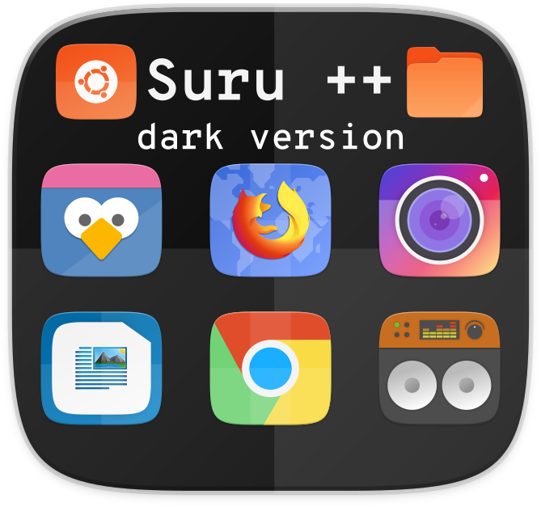

<p align="center"> 
  
</p>

<p align="center"> 

<h3 align="center">A dark third-party Suru icons for Ubuntu 18.04</h3>

<h3 align="center">An elegant, modern and sweet Suru icons based on <a href="https://snwh.org/suru">Suru Icons</a> by Sam Hewitt</h3>


## Installation

The good news is that, you are no longer required to depend on Sam Hewitt's and other Suru++ packs.

### AUR (for Arch LInux and Arch-based distributions)

```shell
pacaur -Ss suru-plus-dark-git
yaourt -Ss suru-plus-dark-git
```

### PPA (Ubuntu and Debian-based distributions)

I am working with the bugs of PPA

### For Lubuntu users

As you want 24px and 26px icons to be colourful in the panel, and want the dark theme, please visit:

* [Suru++ Lubuntu](https://github.com/gusbemacbe/suru-plus-lubuntu/)
* [Suru++ Dark Lubuntu](https://github.com/gusbemacbe/suru-plus-dark-lubuntu/)

### Installation without CLI

* [For users of before Ubuntu 18.04 and any old and new Debian-derived distributions.](instructions_without_cli1.md)
* [For users of Ubuntu 18.04](instructions_without_cli2.md).

### Installation with CLI

* [For users of old Ubuntu versions, Ubuntu 16.04 and any Debian-derived distributions.](instructions_with_cli1.md)
* [For users of Ubuntu 16.04.4 and above, Ubuntu 18.04, Kali Linux and any new Debian-derived distributions.](instructions_with_cli2.md)

## Known bugs

### Some icons are not correctly applied in some apps

Some apps, as AppImage-buit, Flatpak-built, Snap-built and dpkg-installed apps do not use the relative path of an icon. They use the absolute path of an icon, preventing the icon of being correctly applied. Besides, some apps misuse the icon name, for example, GitHub Desktop uses the icon name called `Icon=desktop`.

We provide desktop files (AppImage, native Debian packages, snap app and source codes) for you for being able of applying correctly the icons. You can download them from the repository  <a href="https://github.com/gusbemacbe/suru-plus/tree/master/desktop">Suru++</a>. Copy them to `your_name/local/applications/`, so they won't be reverted to original when you make next updates of Ubuntu and/or PPAs.

We recommend you to back your desktop configuration files up when you intend to make a clean install or reinstall your distribution.

## Report

* Do you find the missed icons?
* Do you find the misused icons?
* Did you find the errors?

Report, PLEASE fill these WELL-DETAILED informations. IT IS REQUIRED OR WE CAN'T PROVIDE! 😠

## Contribution

* Would you like to improve our repository?
* Do you want to add and request the icons? Make a pull request and we will analyse and approve or not

## Contributors

The contributors is on the file [AUTHORS](AUTHORS)

## Changelog

The changelog is available on the release page in theme's repository.

## Donation

<a href="https://www.paypal.com/cgi-bin/webscr?cmd=_donations&business=gusbemacbe%40gmail%2ecom&lc=BR&item_name=Suru%2b%2b%20Project&item_number=SURU2018GBRC&currency_code=USD&bn=PP%2dDonationsBF%3abtn_donate_SM%2egif%3aNonHosted">Donate here</a>

## License

GPL3 © Suru++ Dark by Andrea Bonanni and Gustavo Costa.
